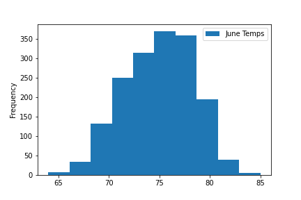
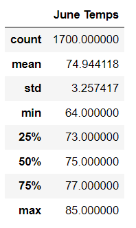
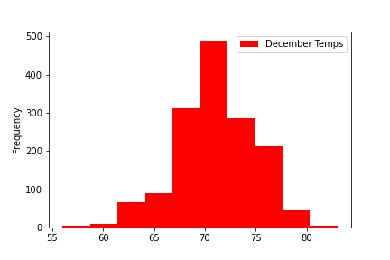
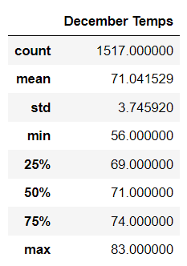
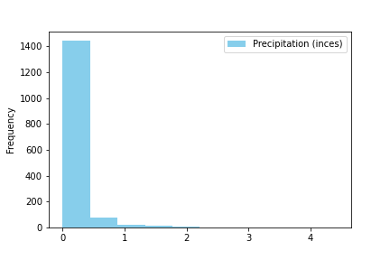
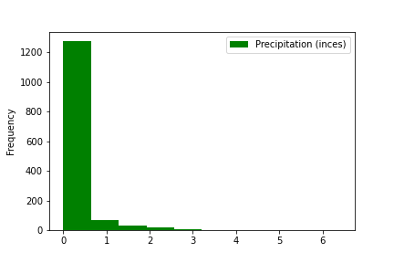

# Surf's Up 

## ***Overview of the analysis:***
----
The purpose of this analysis was to determine the weather patterns for the potential location of a surf shop in Oahu, Hawaii. The information below was collected to help investors predict the success of a business in this specific area, based on the temperature and precipitation. 

## ***Results:***
----
**Please observe the following:** 
  

Temperature Frequency in June:

Temperature Statistics for June: 

Temperature Frequency in December:

Temperature Statistics for December:

  

**With the analysis above, investors can determine:** 

1. There was only a 3% difference in the average temperatures for the months of June and December. 
2. The temperatures in the upper quartiles for those months also only reflected 2-4% differences. 
3. This location would be ideal for a surf shop based on the similarity of temperatures observed for the extreme points of seasons (summer and winter). 

## ***Summary:***
---
In conclusion, the investment of a surf shop in this area will not be negatively affected by the weather conditions in Oahu. In addition to reaching this conclusion using the temperatures as guides, precipitation could also be observed, as shown in the following.
  
Precipitation Frequency in June: 

Precipitation Frequency in December: 

The observation here is that the two months are almost identical when it comes to the frequency of precipitation (which is low) meaning that there no negative affect of percipitation in Oahu. 
  
There are still additional queries that could help determine the accuracy of this analysis, such as the number of observations by weather stations and their frequency of recording data, but the consensus of this analysis is that Oahu will meet the weather parameters requested by our primary investors. 
